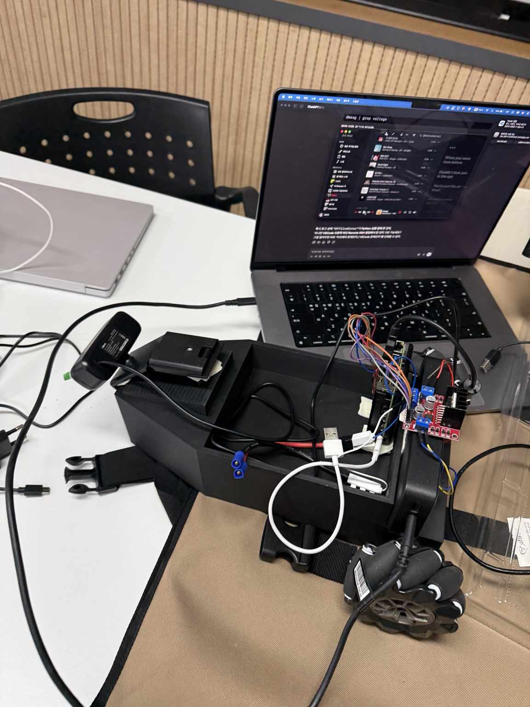
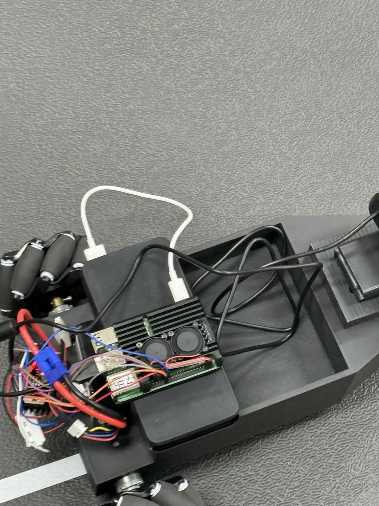
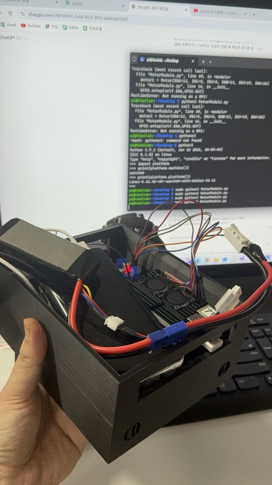
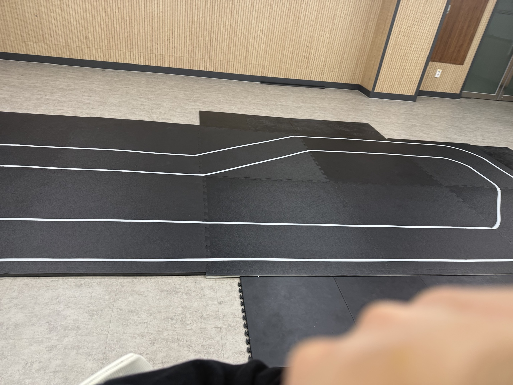

# Project Image Gallery

이 문서는 사물인터넷과 자율주행 프로젝트 진행 과정에서의 하드웨어 구성, 라즈베리파이 디버깅, 주행 트랙 사진을 정리한 기록입니다.

## 1. Hardware setup

- 3D 프린팅 차체
- Raspberry Pi 기반 제어부
- 모터 드라이버 및 배터리 배선
- 카메라/전원/제어 케이블 연결 상태

## 2. Weight balance and embedded layout

- 차량 내부에 Raspberry Pi, 배터리, 모터 드라이버를 배치한 모습
- 초기에는 무게중심이 맞지 않아 회전이 어려웠고, 이후 무게중심을 후방으로 이동시키며 차량 거동을 안정화했습니다.

## 3. Raspberry Pi debugging

- 라즈베리파이에서 GPIO, 모터 제어, 카메라 인식, 자율주행 실행 코드를 디버깅하던 과정입니다.
- 최종적으로 TFLite 양자화 모델을 사용해 실시간 추론 지연을 줄였습니다.

## 4. Evaluation track

- 평가에 사용된 실내 트랙입니다.
- 목표는 정해진 트랙을 10바퀴 완주하는 것이었고, 최종 평가에서 1등을 달성했습니다.
